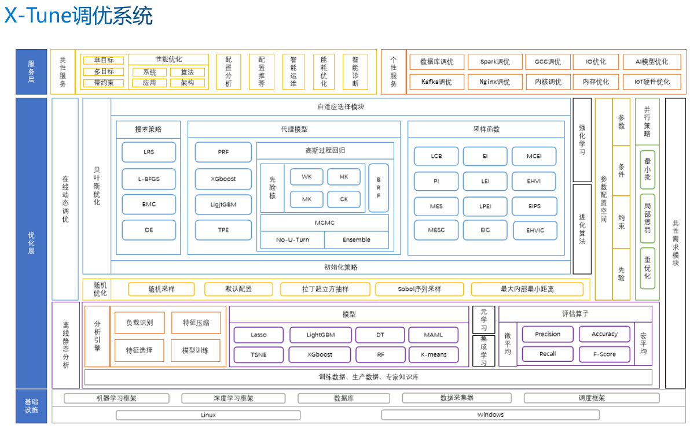

 # 全量代码暂时不公开，仅提供demo参考学习
 

  

+ **X-Tune** is a tuning and analysis `framework` for algorithms, applications and systems.
+ **Tune-X** is an AI performance optimization `library`.

# Tune-X

## 特点 
- 提供单目标、多目标、带约束条件的通用调优服务。
- 提供可迁移学习的、带提前终止的通用优化服务。
- 提供可分布式并行、支持多精度加速的通用优化服务。
- 提供高度原子化、可拔插、积木式、可自由组装的调优方案选择框架。
- 提供调优过程算法的智能切换和自适应调优模型的生成。
- 支持面向各类操作系统的性能调优。
   * CentOS、Ubuntu、OpenEuler、FreertOS、OpenHarmony等。
- 支持通用应用软件的性能调优。
   * SQL Server、Nginx、Docker、Kafka、Kubernetes、Spark等。
- 支持面向人工智能算法模型的性能调优。
   * 自然语言处理、计算机视觉、语音识别等领域。

## 系统架构

